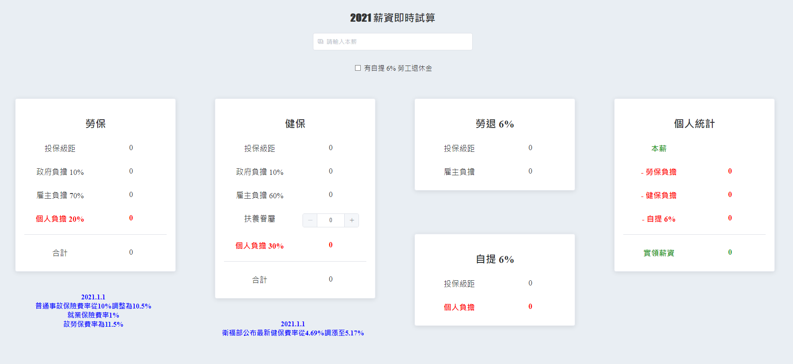
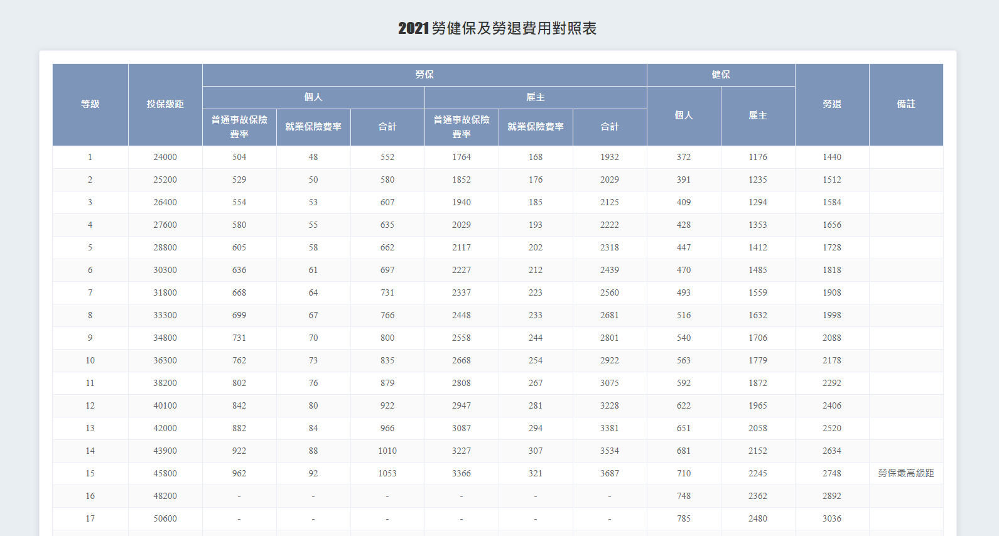

# labor-health-insurance
:rocket: Technology：Vue Cli、Element UI

:fire: 核心構想：嘗試解決每次計算薪資時都須一一查表，尤其是面對全部員工的薪資時容易眼花撩亂，深怕一不小心就填錯，故摒棄查表方式，改為使用一個可即時運算薪資的功能，此小品就這樣誕生了！

## History
| Date | Description |
| -- | -- |
| 2021/07/14 | Init |
| 2021/07/14 | Add Page - 2021 勞保投保薪資分級表 |
| 2021/07/15 | Add Page - 2021 全民健康保險投保金額分級表 |
| 2021/07/16 | Add Page - 2021 薪資即時試算 |
| 2021/07/17 | Add Page - 2021 勞健保及勞退費用對照表 |

## Product
[Labor Health Insurance](https://fakestandard.github.io/labor-health-insurance/#/)

### 2021 勞保投保薪資分級表

### 2021 全民健康保險投保金額分級表

### 2021 薪資即時試算

### 2021 勞健保及勞退費用對照表

### Open Data
[勞保投保薪資分級表](https://data.gov.tw/dataset/6258)

[全民健康保險投保金額分級表](https://data.gov.tw/dataset/20251)
